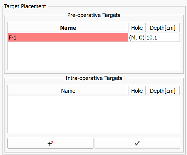

# Cover prostate registration and re-identification of the planned targets

Once Z-frame registration is confirmed, and `CoverProstate` image is acquired, SliceTracker returns to the primary overview step displaying the Cover Prostate image. Usually, the clinical lead wants to see the needle paths of the template to confirm the coverage for needle insertion.  To display it, use the view setting button indicating a grid. 

**IMPORTANT**: Notify the clinical lead of the procedure once you reach this point. This is important to confirm coverage of the gland.

After coverage confirmation, proceed with target re-identification by clicking `Track targets` button. Automatic segmentation of the prostate is triggered if the `Use Deep Learning` setting is enabled.

TODO: Show the post automatic segmentation verification.
After automatic segmentation, you have a chance to verify and modify the segmentation, if necessary.

If proceeding with the manual approach for tracking targets, you need to prepare a rough segmentation of the prostate gland. Your mouse cursor should automatically show the fiducial placement icon.

Click in the vicinity of the prostate capsule boundary to make sure the green outline approximates the capsule. After placing a minimum of two points, the points will be joined by a green outline.

Buttons in the module panel provide the following features:

| Button  | Description |
|---| --- |
||finish segmentation
|,|undo/redo point placement|
||cancel segmentation|

After prostate segmentation has been completed, SliceTracker decides based on the availability of pre-procedural image data about which steps to display next.

**NO PRE-PROCEDURAL DATA AVAILABLE?**: see [Continue without pre-procedural data](continue_without_preop.md)

If pre-procedural image data is available, the layout automatically changes to show the pre-procedural (planning) T2-weighted image on the left, and the intra-procedural `CoverProstate` image on the right. Both viewers show the segmentation outline as overlays. Confirm that segmentations are similar (no large portions of the gland are skipped in either of the images).

You also have the option to add new intra-operative targets to the images, via the intra-operative targets table shown below. Targets added will be joined with the pre-operative targets after registration.

Click the `Run registration` button once segmentation consistency is confirmed and any new targets have been placed.

Upon registration completion, the layout changes to display the biopsy plan on the left, and the registration result on the right.

**IMPORTANT**: Confirm the accuracy of registration with the clinical lead of the procedure!

You can use the following tools to verify registration accuracy:
* `Rock` checkbox: slowly fade back and forth between the registered planning image and the `CoverProstate` image.
* `Flicker` checkbox: quickly flip back and forth between the registered planning image and the `CoverProstate` image.
* `Reveal cursor` button: show mosaic of the registered planning image and the `CoverProstate` image at the cursor location.

|  | |
| --- | --- |
| User interface elements to support registration result evaluation | Reveal cursor in action |

**If registration result is satisfactory**: Click `Approve`, communicate the needle hole and insertion depth to the clinical lead.

**If registration result is NOT satisfactory**, here is what you can try:
* _check different registration types (Rigid or Affine)_: if any of these is satisfactory - approve it.
* _move the target to a more suitable location_: double-click the corresponding target row in the target table, which toggles target move mode. You can then scroll to the desired slice for the target, and place on the updated location.
* _re-do segmentation of the prostate and re-run registration_: this can be done by clicking "Retry" button. Note that this approach is most time-consuming.
