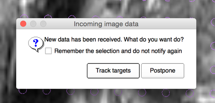

# Tracking targets in the needle confirmation images

Upon arrival of a new needle confirmation image, while SliceTracker is in the overview mode, SliceTracker prompts the operator asking whether tracking should be done automatically for new images.

SliceTracker attempts to perform registration automatically and provides the same evaluation interface as for the cover prostate registration step.

If needle confirmation image registration fails, this is most often due to the significant motion of the prostate/patient. If such motion appears, we advise to create a prostate segmentation in the needle confirmation image.

Once needle confirmation image registration is completed:
* any updates to the hole/insertion depth for the individual targets indicated by the bright color highlight of the corresponding cells in the target table. The previous location of the hole/depth can is accessible in tooltips for the updated cells. Red signalizes that there was motion. Green signalizes a similar hole/depth.
* the clinical lead of the procedure will typically be interested in the location of the needle relative to the intended target. To help with this task, switch to the FourUp layout  and turn on crosshair . Follow the needle track in one of the slice viewers while holding the Shift button. All viewer locations are synchronized.