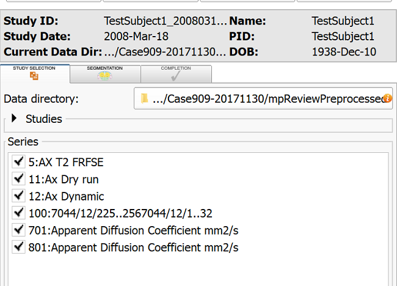
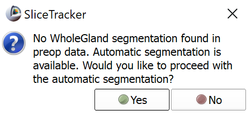
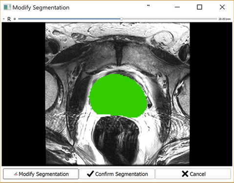
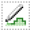

# Prepare pre-procedural data

Once the pre-procedural data is received, you will be guided through the steps to perform data annotation. If you annotate the data for the first time, you will be prompted to enter your last name and confirm some settings, for book-keeping purposes. Accept the defaults if unsure how to proceed.

## Display the series of interest

To annotate the data, first, check the series of interest in the `Study selection` tab. When done, proceed to the `Segmentation` tab.

All of the series you selected are loaded into the viewers and shown in the same plane reformat. Once in the Segmentation tab, choose T2-weighted axial series as the Reference image. This configures the Slicer viewer layout as follows:

* all of the series selected in the previous tab are shown
* each of the viewers is using the same reformat plane
* scroll/zoom/pan is synchronized across the viewers
* if one of the series is a dynamic series \(such as Dynamic Contrast Enhanced \(DCE\) MRI\), you can use the MultiVolumeExplorer panel to display the time curve at the mouse pointer location, and trigger cine mode for the series visualization.

## Adjust window/level and place targets

Use "Add Structure" button to add a new structure you want to segment \(you should at least segment the prostate \("Whole Gland" label in the structures list\). NOTE: This is only necessary if performing manual segmentation. See the Segmentation section below for more information.

Click the Fiducials placement button in the Slicer toolbar, and place targets by clicking on the slice viewers.

TODO: check if the fiducials list should be explicitly selected after placing the targets!

## Segment prostate gland in T2-weighted series

To segment the prostate gland, you have the option of performing automatic or manual segmentation. If the `Use Deep Learning` setting in the settings section is checked, automatic segmentation will be performed. Otherwise, you may proceed with manual segmentation.

### Automatic Segmentation \(using DeepInfer\)

For automatic segmentation, no structure or contour is needed during the preparation phase. The only data required are targets. Once targets are set, activate the Completion tab and click the Save button. You will be prompted with a dialog \(shown above\) informing you that no WholeGland segmentation was found, but automatic segmentation is available. Click `Yes` when prompted. You will then be prompted as to whether an endorectal coil was used during pre-preprocedural imaging. See `Intensity inhomogeneity correction` section below for more information.

Upon automatic segmentation completion, you will be prompted with a verification dialog \(shown below\) where you can confirm the segmentation or modify using `Segment Editor` if necessary. Once confirmed, SliceTracker proceeds to wait for intra-procedural DICOM data for continuing with the workflow.

### Manual Segmentation

If performing manual segmentation, ensure you have created a structure as described above. Then, segment the gland in every other slice by using either the Pencil tool  or Contour tool . Activate the tool by clicking the Pencil icon. Start drawing by clicking the left mouse button. Close the contour by clicking the right mouse button or the Enter key. You can use Undo/Redo buttons  if you made a mistake \(after [this bug](https://github.com/SlicerProstate/mpReview/issues/135) is resolved\).

Once every other slice is contoured, use Dilation effect  to fill the empty slices. Click the Dilate icon, after that click Apply button.

Once the prostate is segmented in T2-weighted series, and the biopsy targets are localized, activate the Completion tab and click Save button. Once this is done, you will return to the SliceTracker module and will wait for the intra-procedural DICOM data to continue with the workflow.

## Intensity inhomogeneity correction

Upon completion of the pre-procedural data annotation, you will be prompted to respond whether an endorectal coil was used during pre-procedural imaging. A dialog with the image volume will allow you to verify this by viewing the volume.

The use of endorectal coil can be recognized by enlarged round shape of the rectum, as shown in the image below.

|  |  |
| --- | --- |
| Apex level. Characteristic "ears" of the coil wire loops. | Mid-gland level. Enlarged air-filled round area arising from the air-filled balloon. |

Once you confirm endorectal coil was used, inhomogeneity correction will be applied automatically, and the corrected image will be loaded into the viewer upon completion.

