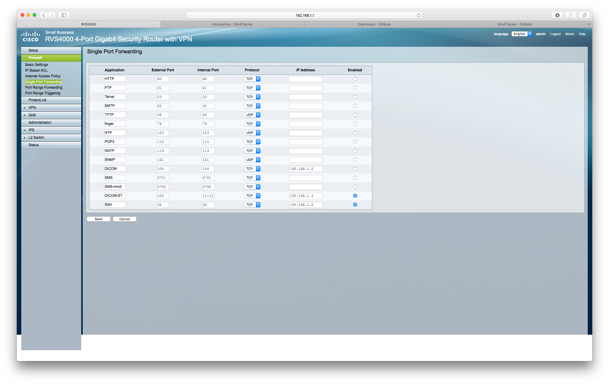

# AMIGO-specific setup

To set up SliceTracker in [AMIGO](http://www.brighamandwomens.org/research/amigo/default.aspx), you will need to:
* Connect the MR scanner network cable to the switch
* Connect the to the computer running SlicerTracker to the switch
* Apply the network configuration (see Network configuration details and Single port forwarding)
* On the MR console, use AMIGO-CLIENT-3 destination to send the data
* If using the Linux cart desktop, use the SliceTracker network configuration

ATTENTION: don't connect two devices with the same network configuration to the switch. Otherwise you will get conflicts regarding the used ip addresses. 

### Network configuration details

| Configuration parameter | Value |
| -- | -- |
| IP | 192.168.1.3 |
| Subnet Mask | 255.255.255.0 |
| Default Gateway (router on OS X)| 192.168.1.1

### Single port forwarding
The switch handles data coming from the MR scanner. Based on its configuration those DICOM images will be forwarded to another ip (with another port).  
Commonly DICOM data is send to port 104. Slicer is not allowed to start a storescp process with port 104, SliceTracker receives its data on port 11112. The following image shows the configuration interface of the switch.

#### Check and ensure the right port to be forwarded

1. Open web browser
2. Enter the following ip: 192.168.1.1
3. User/Password: admin
4. On the left hand side open *Firewall* and click *Single Port Forwarding*
5. Make sure that Application DICOM-ST is enabled
6. Make sure that only one Application with External-Port 104 is enabled

