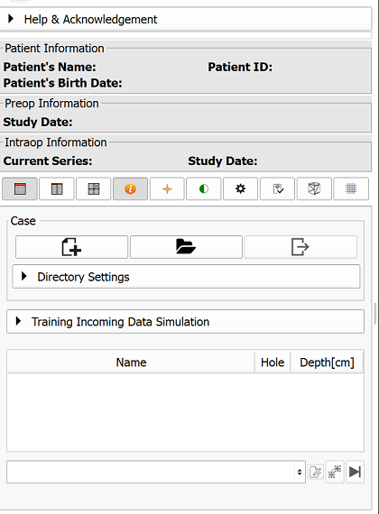
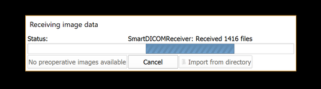
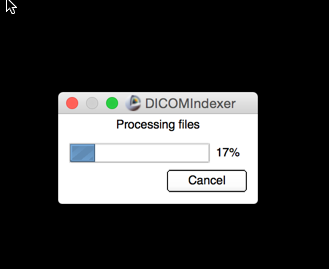

# Biopsy plan preparation

To prepare the biopsy plan, you need to:

1. create a new case
2. load the pre-procedural data
2. prepare pre-procedural data

We will walk you through those steps.

### Creating a new case
As the first step, create a new case with the "New case" button in the SliceTracker console. This will initialize the layout of the directories for the data, and will start the process of listening for the incoming DICOM images. 



**Advanced**: Case Directory Settings panel can be used to change the default location of where cases will be stored.

Once the new case is initiated, you should see the message indicating that SliceTracker is waiting for the incoming DICOM data.


**Important** When prompted about whether you want to end other DICOM listeners running, answer "Yes"! Otherwise, you will not be able to proceed!

The listener will be running on port 11112. You will need to configure your sender of DICOM data accordingly. 

**Advanced**: If you are unable to change the settings (i.e., port) of how the data is sent to the computer running SliceTracker, you can use [a convenience script we provide](https://github.com/SlicerProstate/SliceTracker/blob/master/SliceTracker/SliceTrackerUtils/watch.py) to watch and continuously send DICOM data from a directory to SliceTracker DICOM listener.
* to send files from ```LocalDirectory``` to the instance of SliceTracker running on the same machine:
```
$ python watch.py -d LocalDirectory 
```
* to send files files from ```LocalDirectory``` to the instance of SliceTracker running on IP address 10.0.0.1:
```
$ python watch.py -d LocalDirectory -h 10.0.0.1
```
This convenience script will monitor the content of the directory being watched and all of the sub-directories.

### Loading the pre-procedural data

Once SliceTracker starts receiving the data, you will be notified by a message shown below.



SliceTracker will conclude that all the pre-procedural data has been received after no new files are received for certain time. At that moment, the files received will be imported and indexed into Slicer DICOM database. You will be notified about this process with the message below.



### Preparing pre-procedural data

Once the pre-procedural data is received, you will be guided through the steps to perform data annotation. If you annotate the data for the first time, you will be prompted to enter you last name and confirm certain settings, for book-keeping purposes. Accept the defaults if unsure how to proceed.

To annotate the data, first check the series of interest in the "Study selection" tab. When done, proceed to the "Segmentation" tab. 


All of the series you selected will be loaded in the viewers, and shown in the same plane reformat. Once in the Segmentation tab, choose T2-weighted axial series as the Reference image. This will configure the Slicer viewer layout to show all of the series selected in the previous tab in the same reformat plane, with the scroll/zoom/pan is synchronized over the viewers. 


Use "Add Structure" button to add a new structure you want to segment (you should at least segment the prostate ("Whole Gland" label in the structures list).

Click the Window Level effect button . Update the window/level for each of the viewers as necessary.

Click the Fiducials placement button, and 