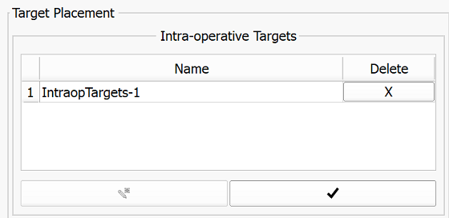
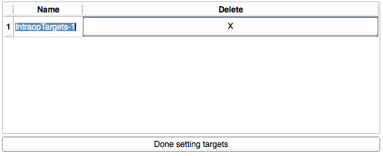

# Continue without pre-procedural image data

Since no information from pre-procedural images about targets are available, SliceTracker will switch to a `Target Placement Mode`, where the user will have to place targets on intra-procedural images. 

To do so, SliceTracker already activated the `Target Placement Mode` which is indicated by the  cursor.

 | 
  -- | -- 
 Created target appears in the main UI target table with its initial name | Double click onto the name cell of the target that you want to rename 

When you finished setting and renaming of targets, just click onto the button `Done setting targets` below the target table. The following prompt will be displayed.

After confirming that you are done with setting and renaming targets, SliceTracker will return to the `Overview` step and will wait for incoming `Needle` images.

