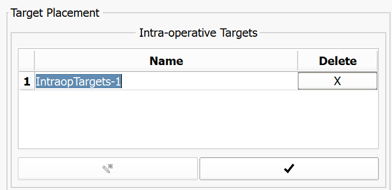

# Continue without pre-procedural image data

Since no information from pre-procedural images about targets are available, SliceTracker will switch to a `Target Placement Mode`, where the user will have to place targets on intra-procedural images.

To do so, SliceTracker already activated the `Target Placement Mode` which is indicated by the  cursor. Click image locations to place fiducials corresponding to biopsy targets.

|  |  |
| --- | --- |
| Created target appears in the main UI target table with its initial name. | Double click onto the name cell of the target that you want to rename. |

After you finished setting and renaming of targets, click the checkmark button \(  \) below the target table. Following this click the "Finish Step" button SliceTracker will switch to the overview mode and will wait for the incoming `Needle` images.

