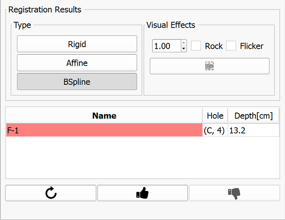

# Cover prostate registration and re-identification of the planned targets

Once z-frame registration is confirmed, and cover prostate image is acquired, the grid of the needle paths of the template will be shown in overlay of the cover prostate image.

**IMPORTANT**: Notify the clinical lead of the procedure once you reach this point. This is important to confirm coverage of the gland.

After coverage is confirmed, proceed with target re-identification by clicking "Track targets" button.

To track targets, you will first prepare a rough segmentation of the prostate gland. Your mouse cursor should automatically show fiducial placement icon . 

Click in the vicinity of the prostate capsule boundary to make sure the green outline approximates the capsule. You will need to place points on multiple slices before the green outline appears.

Buttons in the module panel provide the following features:
* : finish segmentation
*   : undo/redo pont placement
* : cancel segmentation

After completing segmentation result, layout will automatically change to show the pre-procedural (planning) T2-weighted image on the left, and the intra-procedural image on the right, with the segmentation overlays in both viewers. Confirm that segmentations are similar (no large portions of the gland are skipped in either of the images).

Click "Apply registration" once segmentation consistency is confirmed.

Upon completion of registration, you will be presented with a layout showing biopsy plan on the left, and registration result on the right.

**IMPORTANT**: Confirm the accuracy of registration with the clinical lead of the procedure!

You can use the following tools to verify registration accuracy:
* "Rock": slowly fade back and forth between the registered planning image and the cover prostate image.
* "Flicker": quickly flip back and forth between the registered planning image and the cover prostate image.
* "Reveal cursor" button: show mosaic of the registered planning image and the cover prostate image at the cursor location.

|  |  |
| -- | -- |
| User interface elements to support registration result evaluation. | Reveal cursor in action. |

**If registration result is satisfactory**: Click "Approve", communicate the needle hole and insertion depth to the clinical lead.

**If registration result is NOT satisfactory**, here is what you can try:
* _check different registration types (Rigid or Affine)_: if any of these is satisfactory - approve it.
* _move the target to a more suitable location_: double-click the corresponding target row in the target table, which will toggle target move mode. You can then scroll to the desired slice for the target, and place on the updated location.
* _re-do segmentation of the prostate and re-run registration_: this can be done by clicking "Retry" button. Note that this approach is most time-consuming.
