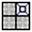

# Tracking targets in the needle confirmation images

If a new `Needle` image arrives while SliceTracker is in the overview mode, it will detect arrival of new `Needle` images automatically, and will prompt the operator asking whether tracking should be done automatically for new images.

SliceTracker will attempt to perform registration automatically, and will provide the same evaluation interface as for the cover prostate registration step. 

When `Needle` image registration fails, this is most often due to very large motion of the prostate/patient. If such large motion is observed, it is advised that prostate is re-segmented in the `Needle` image.

Once `Needle` registration is completed:
* any updates to the hole/insertion depth for the individual targets will be indicated by bright red highlight of the corresponding cells in the target table. Previous location of the hole/depth can be accessed in tooltips for the updated cells.
* the clinical lead of the procedure will typically be interested in the location of the needle relative to the intended target. To help with this task, switch to the FourUp layout  and turn on crosshair . Follow the needle track in one of the slice viewers while holding the Shift button. This will synchronize all viewers locations.

