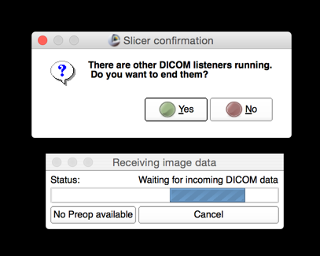

#
Create new case

As the first step, create a new case with the `New case` button in the SliceTracker console. This initializes the layout of the directories for the data and starts the process of listening for the incoming DICOM images.


**Advanced**: Directory Settings panel can be used to change the default location of where cases will be stored.

Once the new case is initiated, you should see the message indicating that SliceTracker is waiting for the incoming DICOM data.



**Important** If prompted about whether you want to end other DICOM listeners running, answer `Yes`. Otherwise, you will not be able to proceed!

The listener will be running on port 11112. You will need to configure your sender of DICOM data accordingly.

**Advanced**: If you are unable to change the settings \(i.e., port\) of how the data is sent to the computer running SliceTracker, you can use [a convenience script we provide](https://github.com/SlicerProstate/SliceTracker/blob/master/SliceTracker/SliceTrackerUtils/watch.py) to watch and continuously send DICOM data from a directory to SliceTracker DICOM listener.

* to send files from `LocalDirectory` to the instance of SliceTracker running on the same machine:
```
$ python watch.py -d LocalDirectory
```
* to send files from `LocalDirectory` to the instance of SliceTracker running on IP address 10.0.0.1:

```
$ python watch.py -d LocalDirectory -h 10.0.0.1
```

This convenience script monitors the content of the directory its sub-directories.


