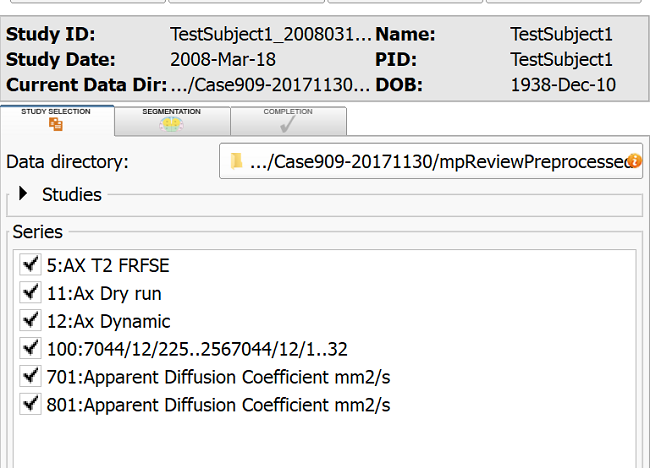
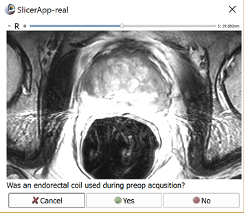

# Prepare pre-procedural data

Once the pre-procedural data is received, you will be guided through the steps to perform data annotation. If you annotate the data for the first time, you will be prompted to enter you last name and confirm certain settings, for book-keeping purposes. Accept the defaults if unsure how to proceed.

## Display the series of interest

To annotate the data, first check the series of interest in the "Study selection" tab. When done, proceed to the "Segmentation" tab. 

All of the series you selected will be loaded in the viewers, and shown in the same plane reformat. Once in the Segmentation tab, choose T2-weighted axial series as the Reference image. This will configure the Slicer viewer layout as follows:

* all of the series selected in the previous tab are shown
* each of the viewers is using the same reformat plane
* scroll/zoom/pan is synchronized over the viewers
* if one of the series is a dynamic series (such as Dynamic Contrast Enhanced (DCE) MRI), you can use the MultiVolumeExplorer panel to display the time curve at the mouse pointer location, and trigger cine mode for the series visualization.

## Adjust window/level and place targets

Use "Add Structure" button to add a new structure you want to segment (you should at least segment the prostate ("Whole Gland" label in the structures list).

Click the Window Level effect button . Update the window/level for each of the viewers as necessary.

Click the Fiducials placement button in the Slicer toolbar, and place targets by clicking in the slice viewers.

TODO: check if the fiducials list should be explicitly selected after placing the targets!

## Segment prostate gland in T2-weighted series

To segment the prostate gland, you will first contour the gland in every other slice using the Pencil tool . Activate the tool by clicking the Pencil icon. Start drawing by clicking the left mouse button. Close the contour by clicking the right mouse button or the Enter key. You can use Undo/Redo buttons  if you made a mistake (after [this bug](https://github.com/SlicerProstate/mpReview/issues/135) is resolved).

Once every other slice is contoured, use Dilation effect  to fill the empty slices. Click the Dilate icon, after that click Apply button.

Once the prostate is segmented in T2-weighted series and the biopsy targets are localized, activate the Completion tab and click Save button. Once this is done, you will return to the SliceTracker and will wait for the intra-procedural DICOM data to continue with the workflow.

## Intensity inhomogeneity correction

Upon completion of the pre-procedural data annotation, you will be prompted to respond whether endorectal coil was used during pre-procedural imaging. 

The use of endorectal coil can be recognized by enlarged round shape of the rectum, as shown in the image below.

:-------------------------:|:-------------------------:|
| ||
| Apex level. Characteristic "ears" of the coil wire loops.  | Mid-gland level. Enlarged air-filled round area arising from the air-filled balloon.|

Once you confirm endorectal coil was used, inhomogeneity correction will be applied automatically, and the corrected image will be loaded into the viewer upon completion.