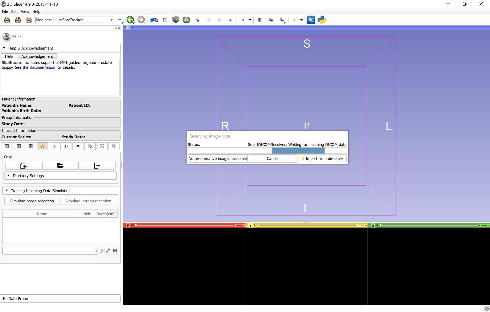

# Training dataset

SliceTracker comes with a de-identified dataset consisting of the planning and intra-procedural MR images. This dataset can be used to learn and practice SliceTracker workflow described in the subsequent sections of this document.

To use SliceTracker with the training dataset, start a new case. The following image shows the UI of SliceTracker after creating a new case.

On the left side you will find a collapsible panel "Training Incoming Data Simulation". Expand that panel by clicking the title, and click "Simulate preop reception" button. This will download and import the example data into SliceTracker. Once download and import are completed, you will be prompted to proceed with the [biopsy plan preparation step](https://fedorov.gitbooks.io/slicetracker/content/docs/user_guide/bx_planning.html). Upon completing plan preparation, click the "Simulate intraop reception" button to download and import intra-procedural data, and continue with the [intra-procedural part of the workflow](https://fedorov.gitbooks.io/slicetracker/content/docs/user_guide/bx_tracking.html).

