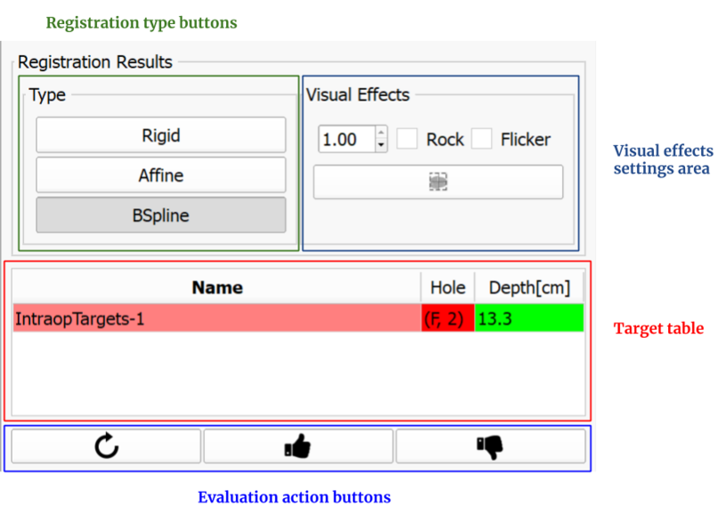

# User Interface Description

## 3D Slicer interface overview

Once SliceTracker is opened, note the purpose of the various components of the application interface.

1. **Main toolbar**: this area contains shortcut buttons for some of the general purpose functions of 3D Slicer

2. **Module control panel**: this is the area where various controls and user interface elements for SliceTracker are located. These are described in detail in the next section.

3. **Viewers**: configuration of this area, which contains combinations of 2-d/3-d viewer sub-areas, will be updated automatically depending on the specific step of the workflow. 

4. **DataProbe panel**: this area can be used to check the coordinates of the cursor and the number of the currently visible slice.

5. **Progress reporting area**: in some steps of the workflow, this area will be used to report progress.

## SliceTracker interface overview
The overview mode allows user to create/load cases, trigger target tracking and view already processed registration results. It's the main step which is displayed after loading SliceTracker.

| User Interface Element | Description |
| -- | -- |
| Case/patient watch box | Displays information about the current patient, as well as relevant pre-operative and intra-operative imaging information. |
| View options bar | Provides buttons for controlling the visibility of annotations, crosshair, Z-frame model, grid and computed needle path model. All supported layouts are available through buttons and a button is also included for `WindowLevelEffect`; for changing the window level with respect to fore -and background. 
|
| Case directory settings | This area includes a directory selector which represents the root directory for all cases. Furthermore when starting/loading a case, all directory information to that case are displayed in the directory watch box below the `Cases Root Directory` directory selector. |
| Case action buttons | Action buttons for creating a new case, loading/continuing an existing case, or closing/completing a case. |
| Training/Simulation area | These buttons simulate incoming transfer of DICOM images. It can be used for pre- and intra-procedural images. |
| Target table | Once a case has been loaded and pre-procedural data has been processed, all set targets will be listed in that table. Additional to that, information about cursor distance, grid hole and depth for needle insertion are computed. |
| Intra-procedural image selection/targeting | As soon as intra-procedural images are received and loaded, they will appear in the series selector combobox. Colors indicate the availability of registration results. Images can only be skipped in specific circumstances. `Cover Prostate` and `Cover Template` images cannot be skipped since they are essential for the whole process of registration. The buttons to the right of the selector are for allowing the user to change the series type, initiate tracking of targets, and skip the selected series, respectively. |

## Module settings
For accessing the module settings you will need to use  from the `view options bar`.

SliceTracker provides some module settings that needs to be changed in case of:
* series description of the DICOM images differ from the one shown in the module settings
* you want to use `demo mode` which hides patient specific information from SliceTracker (not yet from mpReview)
* change the maximum rating score for registration results
* you want to use a different color map 

## Segmentation
For initiating target tracking a segmentation mask needs to be created which covers the area of the prostate. The image below describes the user interface elements of that step.

## Registration evaluation 

| User Interface Element | Description |
| -- | -- |
| Registration type buttons | All different registration types are available for viewing. The registration result is displayed according to the selected registration type.|
| Visual effects settings area|<ul><li>Rock mode checkbox: Opacity value changes slowly between foreground and background. </li><li>Flicker mode checkbox: Opacity value changes flickers between foreground and background.</li><li>Reveal cursor button: Mode for directly comparing foreground and background volume</li></ul>|
| Target table| The target table lists all targets that has been identified during pre-procedural preparation or during target initialization in intra-procedural data (if no pre-procedural data exists).<ul><li>Name: displays name of the target as set during target initialization</li><li>Distance (cm): displays distance x,y,z and 3D from cursor to target </li><li>Hole: displays optimal  grid hole computed for needle insertion in order to reach the target. <ul><li>Green: hole match in comparison to first planning/intraop registration computed hole</li><li>Red: hole mismatch comparing to first planning/intraop registration  computed hole</li></ul><li>Depth[cm]: displays the depth that the needle needs to be inserted for reaching the target position<ul><li>Green: depth match in comparison to first planning/intraop registration computed depth </li><li>Red: depth mismatch comparing to first planning/intraop registration computed Depth (difference > 0.5cm)</li>|
| Evaluation action buttons| <ul><li>"Retry" button: If the registration result is not satisfying, the user has the choice to retry(re-segment) the prostate and so that the registration can be re-run with another segmentation. </li><li>"Approve" button: A satisfying registration result can be approved which triggers saving of the registration result and returning to the overview mode</li><li>"Reject" button: if the registration result is not satisfying at all (even after retrying) the user has the possibility to reject the registration result. Rejection will trigger saving of the registration results (for later reading) and returns to overview mode.</li></ul>|
