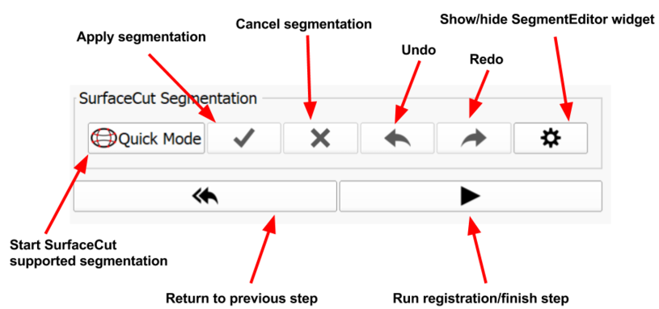

# User Interface Description

## 3D Slicer interface overview

Once SliceTracker is opened, note the purpose of the various components of the application interface.

1. **module control panel**: this is the area where various controls and user interface elements for SliceTracker are located. These are described in the next section.

2. **viewers**: configuration of this area, which contains combinations of 2-d/3-d viewer sub-areas, will be updated automatically depending on the specific step of teh workflow. 

3. **progress reporting area**: in some steps of the workflow, this area will be used to report progress.

4. **DataProbe** panel: this area can be used to check the coordinates of the cursor and the number of the currently visible slice.

## SliceTracker interface overview
The overview mode allows user to create/load cases, trigger target tracking and view already processed registration results. It's the main step which is displayed after loading SliceTracker.

| User Interface Element | Description |
| -- | -- |
| Case/patient watch box | Displays information about the current patient, pre-procedural and current study |
| View options bar | Provides buttons for controlling the visibility of annotations, crosshair, Z-frame model, grid and computed needle path model. All supported layouts are available through buttons and additional to that the `WindowLevelEffect` for changing the window level with respect to fore -and background is included.  |
| Case directory settings area | This area includes a directory selector which represents the root directory for all cases. Furthermore when starting/loading a case, all directory information to that case are displayed in the directory watch box below the `Cases Root Directory` directory selector. |
| New/open case action buttons | Action buttons for creating a new case or loading/continuing an existing case. |
| Target table | Once a case has been loaded and pre-procedural data has been processed, all set targets will be listed in that table. Additional to that, information about cursor distance, grid hole and depth for needle insertion are computed. |
| Intra-procedural image selection | As soon as intra-procedural images are received and loaded, they will appear in that selector. Colors indicate the availability of registration results. Images can only be skipped in specific circumstances. `Cover Prostate` and `Cover Template` images cannot be skipped since they are essential for the whole process of doing registration. |
| Case/target tracking action buttons | Divided into three buttons this area allows the user to initiate the tracking of targets, closing a case (can be continued) or complete a case (can only be opened in read only) |

## Segmentation
For initiating target tracking a segmentation mask needs to be created which covers the area of the prostate. The image below describes the user interface elements of that step.

## Registration evaluation 

| User Interface Element | Description |
| -- | -- |
| Registration type buttons | All different registration types are available for viewing. The registration result is displayed according to the selected registration type.|
| Visual effects settings area|<ul><li>Rock mode checkbox: Opacity value changes slowly between foreground and background. </li><li>Flicker mode checkbox: Opacity value changes flickers between foreground and background.</li><li>Reveal cursor button: Mode for directly comparing foreground and background volume</li></ul>|
| Target table| The target table lists all targets that has been identified during pre-procedural preparation or during target initialization in intra-procedural data (if no pre-procedural data exists).<ul><li>Name: displays name of the target as set during target initialization</li><li>Distance (cm): displays distance x,y,z and 3D from cursor to target </li><li>Hole: displays optimal  grid hole computed for needle insertion in order to reach the target. <ul><li>Green: hole match in comparison to first planning/intraop registration computed hole</li><li>Red: hole mismatch comparing to first planning/intraop registration  computed hole</li></ul><li>Depth[cm]: displays the depth that the needle needs to be inserted for reaching the target position<ul><li>Green: depth match in comparison to first planning/intraop registration computed depth </li><li>Red: depth mismatch comparing to first planning/intraop registration computed Depth (difference > 0.5cm)</li>|
| Evaluation action buttons| <ul><li>"Retry" button: If the registration result is not satisfying, the user has the choice to retry(re-segment) the prostate and so that the registration can be re-run with another segmentation. </li><li>"Approve" button: A satisfying registration result can be approved which triggers saving of the registration result and returning to the overview mode</li><li>"Reject" button: if the registration result is not satisfying at all (even after retrying) the user has the possibility to reject the registration result. Rejection will trigger saving of the registration results (for later reading) and returns to overview mode.</li></ul>|
