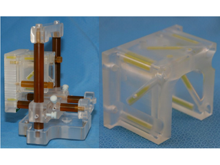
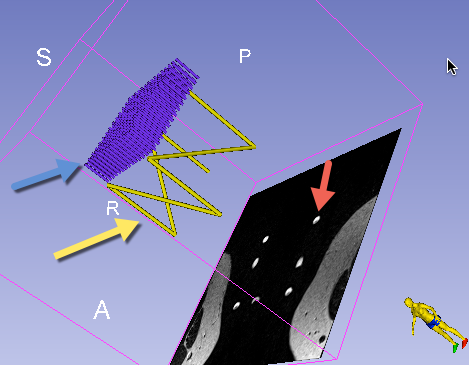
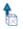
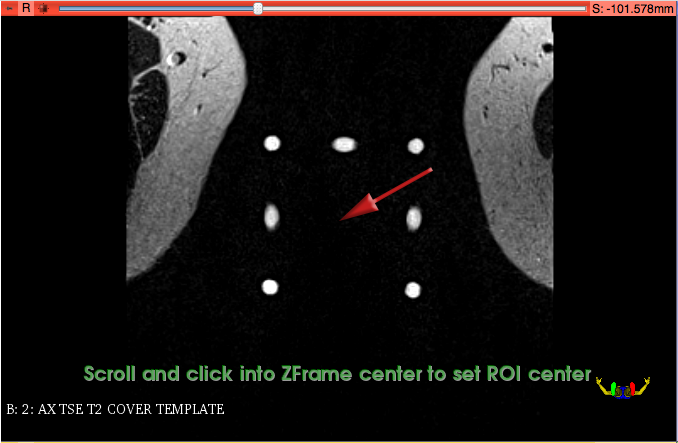
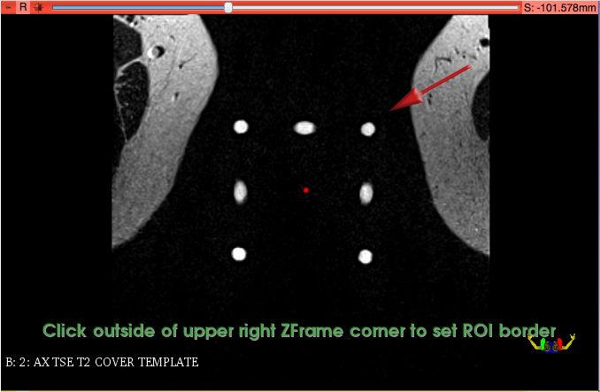
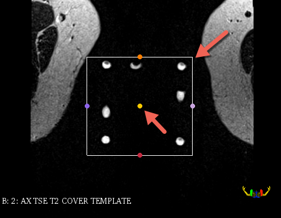
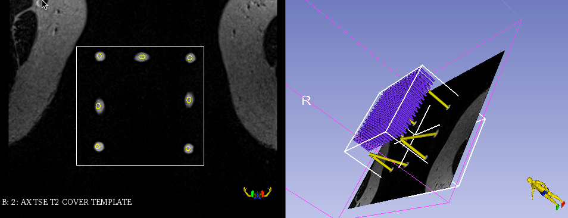

#
Z-frame calibration

Z-frame is a calibration device that consists of a plastic enclosure that attaches rigidly to the template assembly (see figure below), and 7 elongated capsules containing liquid that gives bright signal in certain types of MR images.

## Background
Given the known configuration of these capsules and their appearance in the `ZFrame` image, it is possible to align the known configuration with the corresponding image artifacts, and thus establish a transformation between the biopsy template and the scanner coordinate system.

|  |  |
| -- | -- |
| Biopsy template assembly (left) and Z-frame. MR-visible capsules are yellow within a plexiglass enclosure. | Z-frame (yellow arrow) and needle tracks of the template (blue arrow) models before calibration. The red arrow points to the artifacts corresponding to the Z-frame in the `ZFrame` image slice. |

## Workflow

Once `ZFrame` image is received, it will be automatically loaded and displayed. To perform Z-frame calibration, you need to define the region of interest (ROI) in the image corresponding to the location of the Z-frame artifacts.

After `ZFrame` image is loaded, ROI placement mode will be activated automatically, which is indicated by the  cursor. Follow the steps shown below.

| Step 1 | Step 2 | Step 3 |
| -- | -- | -- |
|  |  |  |
| Click once in the center of the group of bright dots corresponding to the Z-frame | Click once in the corner just outside that group | Make sure all dots are within the rectangular selection area |

After confirming that all dots are within the ROI, you will need to execute the Z-frame calibration by clicking "Run ZFrame Registration" in the module control panel.

Upon Z-frame calibration has finished, the 3D viewer will show the co-registered position of the `ZFrame` image.

**IMPORTANT**: Verify that Z-frame calibration was completed correctly by confirming the alignment of the Z-frame model with the Z-frame image artifacts, both in 2D and 3D views. In the 2D view, intersections of the Z-frame model with the image will be indicated by yellow outlines. Those must closely follow the bright artifacts of the Z-frame, as shown in the figure below. If you are unsure, please confirm with the clinical lead of the procedure!

In case of a Z-frame calibration misalignment see [Correct Z-frame calibration misalignment](correct_z-frame_calibration_misalignment.md)

You must confirm registration accuracy by clicking "Confirm registration accuracy" button in the SliceTracker panel to proceed with the next steps of the workflow.