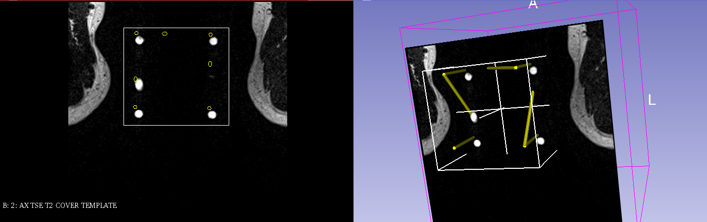
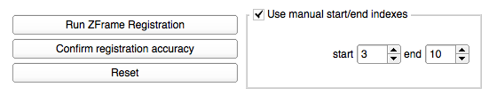
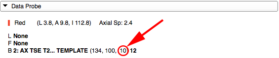

# Z-frame calibration

Z-frame is a calibration device that consists of a plastic enclosure that attaches rigidly to the template assembly (see figure below), and 7 elongated capsules containing liquid that gives bright signal in certain types of MR images. 

Given the known configuration of these capsules and their appearance in the `ZFrame` image, it is possible to align the known configuration with the corresponding image artifacts, and thus establish a transformation between the biopsy template and the scanner coordinate system.

|  |  |
| -- | -- |
| Biopsy template assembly (left) and Z-frame. MR-visible capsules are of yellow color within a plexiglass enclosure. | Z-frame (yellow arrow) and needle tracks of the template (blue arrow) models before calibration. Red arrow points to the artifacts corresponding to the Z-frame in the `ZFrame` image slice. |

Once `ZFrame` image is received, it will be automatically loaded and displayed. To perform Z-frame calibration, you will need to define the region of interest (ROI) in the image corresponding to the location of the Z-frame artifacts. 

ROI placement mode will be activated automatically once `ZFrame` image is loaded, and the mouse pointer icon   will reflect this. 

With the ROI mode enabled follow the steps shown below.

| Step 1 | Step 2 | Step 3 |
| -- | -- | -- |
|  |  |  |
| Click once in the center of the group of bright dots corresponding to the Z-frame | Click once in the corner just outside that group | Make sure all dots are within the rectangular selection area |

Once you confirm that all dots are within the ROI, click "Run ZFrame Registration" in the module control panel.

Once Z-frame calibration is completed, 3D viewer will show the co-registered position of the `ZFrame` image. 

**IMPORTANT**: Verify that Z-frame calibration was completed correctly by confirming the alignment of the Z-frame model with the Z-frame image artifacts, both in 2D and 3D views. In the 2D view, intersections of the Z-frame model with the image will be indicated by yellow outlines. Those must closely follow the bright artifacts of the Z-frame, as shown in the figure below. If you are unsure, please confirm with the clinical lead of the procedure!

## Z-frame model misaligned with Z-frame image artifacts?

In case of the Z-frame model not properly aligned with the Z-frame image artifacts, you will need to manually set the slice range where the Z-frame calibration runs on. The following screenshot shows such a misalignment.

In order to set the manual start/end indexes, you will need to check "Use manual start/end indexes" as displayed below.

**KNOW HOW TO FIND OUT SLICE INDEX**: In the lower left corner of the main Slicer user interface you will find a collapsible button "Data Probe". This module can be used to find out the start and end index of the Z-frame image artifacts.

Start index: Scroll to the very first slice, where all artifacts are clearly visible (8 white dots)
End index: Scroll to the very last slice, where all artifacts are clearly visible (8 white dots)

The image below shows where to find the slice index of the current slice. **NOTE:** Make sure to move the cursor within the current slice view, so that the Data Probe module is updated according to it. The Date Probe module will only display values if the cursor is inside that slice view.

You must confirm registration accuracy by clicking "Confirm registration accuracy" button in the SliceTracker panel in order to proceed with the next steps of the workflow.

