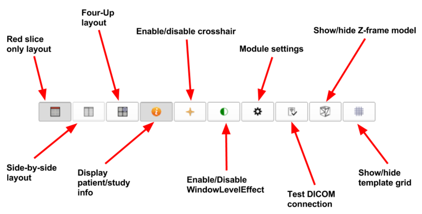

# User Interface Description

This section describes the overall user interface in detail.

## 3D Slicer interface overview

1. **Main toolbar**: this area contains shortcut buttons for some of the general purpose functions of 3D Slicer

2. **Module control panel**: various controls and user interface elements for SliceTracker. The next section describes those in detail.

3. **Viewers**: configuration of this area, which contains combinations of 2D/3D viewer sub-areas, automatically updated depending on the specific step of the workflow.

4. **Data Probe panel**: this area can be used to check the coordinates of the cursor and the number of the currently visible slice.

5. **Progress reporting area**: visual feedback about: receive of new DICOM images; indexing of DICOM series; loading/saving results

## SliceTracker user interface overview
The overview mode allows the user to create/load/complete cases, trigger target tracking (running registration for target re-identification) and view processed registration results. It is the primary step after loading SliceTracker.

| User Interface Element | Description |
| -- | -- |
| Case/patient watch box | Displays information about the current patient, as well as relevant pre-operative and intra-operative imaging information. |
| View options bar | Provides buttons for accessing module settings and controlling the visibility patient-specific information, crosshair, Z-frame model, and template grid. All supported layouts are available through buttons. A button for testing the DICOM connection is also available. 
|
| Case directory settings | This area includes a directory selector which represents the root directory for all cases. When starting a new case, SliceTracker predicts the new case number based on the root case directory. Furthermore, when starting/loading a case, directory information to that case is displayed in the directory watch box below the `Cases Root Directory` directory selector. |
| Case action buttons | Action buttons for creating a new case, loading/continuing an existing case, or closing/completing a case. |
| Training/Simulation area | These buttons simulate the incoming transfer of DICOM images. SliceTracker provides pre- and intra-procedural images for simulation/training purposes. |
| Target table | The target table lists all targets that were identified during the workflow. Additionally, information about calculated grid hole and depth for needle insertion are displayed. |
| Intra-procedural image selection/targeting | As soon as intra-procedural images are received and loaded, they appear in the series selector combo box. Colors indicate the availability of registration results. Images can only be skipped under certain circumstances. Initial `Cover Prostate` and `Cover Template` images cannot be skipped since they are essential for the whole process of registration. The buttons to the right of the selector are for allowing the user to change the series type, initiate tracking of targets, and skip the selected series, respectively. |

## Module settings
For accessing the module settings, you need to use  from the `view options bar`.

Changing SliceTracker module settings is recommended in case of:
* series description pattern of DICOM images used for series type assignment differs from the currently specified pattern
* you want to use `demo mode` which hides patient-specific information from SliceTracker (not yet from mpReview)
* you want to use a different color map
* you wish to change the segmentation algorithm used for automatic segmentation

## Segmentation
For initiating target registration, a segmentation mask needs to be created which covers the area of the prostate. The image below describes the user interface elements of that step (presented after performing automatic segmentation).

## Registration evaluation

| User Interface Element | Description |
| -- | -- |
| Registration type buttons | All different registration types are available for viewing. The registration result is displayed according to the selected registration type.|
| Visual effects settings area|<ul><li>Rock mode checkbox: Opacity value changes slowly between foreground and background. </li><li>Flicker mode checkbox: Opacity value changes flicker between foreground and background.</li><li>Reveal cursor button: Mode for directly comparing foreground and background volume</li></ul>|
| Target table| The target table lists all targets that have been identified during pre-procedural preparation or during target initialization in intra-procedural data (if no pre-procedural data exists).<ul><li>Name: displays name of the target as set during target initialization</li><li>Hole: displays optimal grid hole computed for needle insertion in order to reach the target. <ul><li>Green: hole match in comparison to first planning/intraop registration computed hole</li><li>Red: hole mismatch comparing to first planning/intraop registration computed hole</li></ul><li>Depth[cm]: displays the depth that the needle needs to be inserted for reaching the target position<ul><li>Green: depth match in comparison to first planning/intraop registration computed depth </li><li>Red: depth mismatch comparing to first planning/intraop registration computed Depth (difference > 0.5cm)</li>|
| Evaluation action buttons (left to right) | <ul><li>"Retry" button: If the registration result is not satisfying, the user has the choice to retry(re-segment) the prostate (manual or automatic) and so that the registration can be re-run with another segmentation. </li><li>"Approve" button: A satisfying registration result can be approved which triggers saving of the registration result and returning to the overview mode</li><li>"Reject" button: if the registration result is not satisfactory (even after retrying) the user has the possibility to reject the registration result. Rejection will trigger saving of the registration results (for later reading) and returns to overview mode.</li></ul>|
